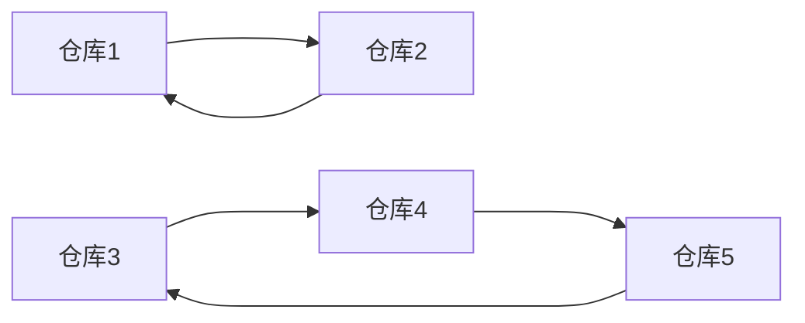

## 斯特林数
斯特林数主要有两类，分别是 **第一类斯特林数** 与 **第二类斯特林数**。
这两类数都来源于实际的问题，我们分别来介绍：

#### 第一类斯特林数
**引例1：**
假设存在 $n$ 个仓库，每个仓库分别有 2 把钥匙，每个仓库都对应一个看管人员，请问钥匙改怎么样存放才能使每个看管人员都能打开所有的仓库。

**讨论：**
这个问题是很显然的一个问题：

我们把 `仓库2` 的钥匙放在 `仓库1`，`仓库3` 的钥匙放在 `仓库2`。形成一个环状，那么很显然就可以打开其中一个仓库就能连续打开其他所有的仓库了。
下面的情况也是可以的：

那么，我们再来考虑另外一个问题：
**引例2：**
假设现在有一个公司，存在 $k$ 个部门，公司总共存在 $n$ 个仓库，也同样存在 $n$ 个看管人员。现在每个部门需要划分一部分仓库给它们使用，并且保证每个部门内部，对应的看管人员都可以打开仓库内部的所有仓库，但不能打开其他部门的任意仓库，有多少种划分方案？

显然，如果有 2 个部分，5 个仓库，也许我们可以考虑这样划分：

以上两个问题的本质，实际上就是再问：
**存在 $1 \sim n$ 的一个序列，将这 $n$ 个数字划分成 $k$ 个圆，有多少种不同的分法？**

这便是第一类斯特林数的定义，我们记为：$s(n,k)$

如何求解第一类斯特林数呢？
我们可以采取递推的方式，我们考虑放入第 $n$ 个数字时候的情况：

**1. 放进一个新的圆里**
这个时候我们把第 $n$ 个元素单独拿出来作为一个新的"圆"，因此情况数为：$s(n-1,k-1)$

**2. 放进原来的圆里**
这样的话，原先 $n-1$ 已经组成了 $k$ 个圆，现在我们把这第 $n$ 个数字随机插入一个位置，很容易可以得到，有多少个数字，我们插入的位置就有多少个，那么，情况数显然为：$(n-1)\times s(n-1,k)$

我们将这两种情况加起来：
$$
s(n,k) = s(n-1,k-1)+(n-1)\times s(n-1,k)
$$
而我们经常使用
$$
\genfrac[]{0pt}{}{n}{k}
$$
来表示 $s(n,k)$

也就是说我们有：
$$
\genfrac[]{0pt}{}{n}{k}=\genfrac[]{0pt}{}{n-1}{k-1}+(n-1)\times \genfrac[]{0pt}{}{n-1}{k}
$$

而我们人为规定边界为：
$$
\genfrac[]{0pt}{}{n}{n} = 1 ~~ (n\geq 0) \\
\;\\
\genfrac[]{0pt}{}{n}{0} = 0 ~~ (n\geq 1)
$$

---------------

#### 第二类斯特林数
第二类斯特林数其实就是说：
**存在 $1 \sim n$ 的一个序列，将这 $n$ 个数字划分成 $k$ 个集合，有多少种不同的分法？** 

我们一般将第二类斯特林数记作：$S(n,k)$
也可以记作：
$$
\genfrac\{\}{0pt}{}{n}{k}
$$

我们同样考虑递推来求解：
**1. 放进一个新的集合里**
这个时候我们把第 $n$ 个元素单独拿出来作为一个新的集合，因此情况数为：$S(n-1,k-1)$

**2. 放进原来的集合里**
这样的话，原先 $n-1$ 已经组成了 $k$ 个集合，现在我们把这第 $n$ 个数字随机放进一个集合，很容易可以得到，有多少个集合，我们可以放入的位置就有多少个，那么，情况数显然为：$k\times S(n-1,k)$

因此，我们有：
$$
\genfrac\{\}{0px}{}{n}{k} =\genfrac\{\}{0px}{}{n-1}{k-1}+k\times \genfrac\{\}{0px}{}{n-1}{k}
$$
边界条件为：
$$
\genfrac\{\}{0pt}{}{n}{n} = 1 ~~ (n\geq 0) \\
\;\\
\genfrac\{\}{0pt}{}{n}{0} = 0 ~~ (n\geq 1)
$$